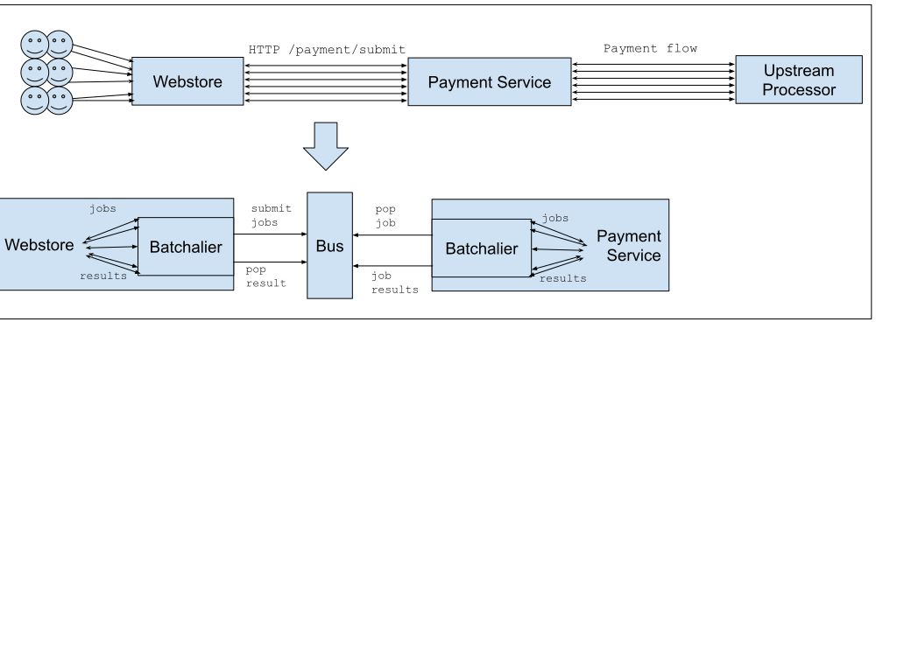

Important
=========
This repository was developed for the purpose of a technical take-home test and is not actively maintained at present.

If you think it is a good idea and would actually like to see it developed give me a shout in the issue tracker!

Batchalier provides convienient micro-batching for jobs via a kafka bus.

[](https://github.com/dbergamin/batchalier/actions/workflows/ci.yml)
[](https://docs.python.org/3.11/index.html)


Why use Batchalier?
===================
The Batchalier is your knight in shining armour, a throwback to the gentlemen and scholarly cavalier of the middle ages. It stands ready to marshal and safeguard your jobs into nice orderly batches. It’s attitude towards batches is anything but cavalier, and it handles your jobs with utmost respect and care.

So when might you want to employ it?

Imagine a simple internal payment-service that processes payments. Consumers includes customers who buy off our web store, backoffice staff who manually run payments, and a recurring billing system for subscription customers.

When our webstore, backoffice system or billing system wants to take a payment, it connects to our payment service and sends a payment request. Our payment service does some validation, a bit of bit shuffling and then sends a request to our upstream processor.

When we start out, we might simply forward an upstream request from every system to the payment processor. However, as we grow to submitting thousands of payment requests per second, we might look to use Batchalier.

Batchalier allows your submitter to simply fire off jobs as before, and your processor to pluck jobs off a queue as fast as it can. It depends on availability of a Kafka cluster.

Reduce Overhead
---------------
In a busy webstore taking many payments each second, we can end up making thousands of API calls to send our payment to the internal payment service.



Every single API call may involve:
* Authentication (transport and application level)
* Many small requests, a large portion of each being transport and http protocol overhead

By batching up a quantity of these requests into one ‘batch’, we can incur overhead once per many requests instead of with every one, and send more efficiently sized frames to increase total throughput.

Prioritise requests and stabilise throughput
--------------------------------------------
We want the requests from our customers to be processed at a higher priority level than requests from our subscription service, as a customer is waiting on the other end.

Without Batchalier, our payment system simply shoots off all requests as they come in. This could result in our subscription service DDOSing our customer store payments for a short period of time which would be undesirable. As we rely on client exponential backoff, we also incur a lot of noise that reduces our total throughput as requests fail and reattempt.

With Batchalier, our payment system simply asks for the next job on a work loop, gets handed the most important pending requests, and then processes them with the upstream at a controlled rate of its choosing.

Fault Tolerance
---------------
If our payment service goes down or the upstream dies, we want to be able to resume processing jobs easily. Using Batchalier to coordinate mitigates the thundering herd and maximises throughput on resumption of service.

Batchalier takes care of persisting our job submissions and it can see what the last successfully processed job was, so when apps are back, it can simply pick up where it left off.

Concepts
========

Submitter
---------
A Submitter will collect jobs until a maximum size or latency threshold is reached, at which point it will send the batch of Jobs upstream.

Default implementation is the KafkaSubmitter which submits to a Kafka topic per priority and processor application, and waits for a BatchResult to arrive on a corresponding topic.

If the BatchResult is not received within the BatchTimeout interval, it will timeout all jobs within the batch as timeout, which will notify submitters that their jobs have failed and should be resubmitted.

Note well: the Processor will receive jobs at least once so jobs should be processed in an idempotent manner. The job handler must perform the necessary checks to verify the status of a job before taking action.

Processor
---------
A processor runs as part of an application that receives and processes jobs.

It will receive an stream of jobs in priority order and pop the results on a message bus when complete.

Structs
-------
*Job*
```
  Guid id: Unique id for the job
  String processor: Arbitrary name, identifies job processor application so it can be picked up by the right app e.g. payments
  String group: Arbitrary name identifies type of job so processor knows how to read the data e.g. store-payment
  JobStatus status: Status of the job
  Object data: Arbitrary data. A processor must know the JobGroup to read this data and process the job. E.g. a HTTP post object
```

*JobStatus* (enum)
```
  NEW: State upon job instantiation, not yet submitted for batching
  SUBMITTED: Submitted (may be awaiting batching), awaiting result
  PROCESSED_OK: Processed successfully
  PROCESSED_ERROR: Processed but failed due to an error in the processor
  BATCH_FAILED: Batching issue, check the batch for more information
```

*BatchPriority* (enum)
```
  REALTIME: Submit immediately in a batch of one. Processed first.
  NORMAL: Will be processed when there are no realtime batches to complete.
  SLOW: Subject to batching and will be processed when there are no realtime or normal batches to complete.
```

*JobResult*
```
  Guid job_id
  JobStatus status
  Object data
```

Sample Code
===========

Submitter
---------
Once per application:
```
# If you wanted to tweak submitter config or craft submitters for multiple remotes etc you can do it here

import batchalier

# Basic config will give you default configuration for realtime/normal/slow batch submitters to a given remote
batchalier.basic_config(batch_bus=”kafka://kafka-bachalier-dev-01:9092”)
```

Elsewhere in your application:
```
from batchalier import Job, get_submitter
submitter = get_submitter(name=”default-realtime”)

@app.route('/api/payment', methods=['POST'])
def post_payment():
    data = request.get_json()
    job = Job(group=”payment-submit”,data=data)
    result = submitter.submit(job)
    if result.status == PROCESSED_OK:
        logging.info(“Payment succeeded”)
    elif result.status == PROCESSED_ERROR:
        logging.warn(f“Payment error: {error}”)
    else:
        raise RuntimeError(“Unexpected job status”)
```

Processor
---------
Once per application:
```
# If you wanted to tweak processor config or craft processors for multiple remotes etc you can do it here
import batchalier

# Basic config will give you default configuration for realtime/normal/slow batch processors to a given batch source.
batchalier.basic_config(batch_bus=”kafka://kafka-batchalier-dev:9092”)

def graceful_stop(sig, frame):
    # Will send all processors into ‘shutdown’ mode; generator will return
    batchalier.shutdown()

signal.signal(signal.SIGTERM, graceful_stop)
```

Elsewhere in your application:
```
from batchalier import Job, get_batch_processor

class PaymentJobHandler:
    def process(self, job):
        # note that job handling should be idempotent
        # do the processing using the data in job.data, then call:
        job.complete(arbitrary_data)

processor = get_batch_processor(name=”payments”)
handlers = {
    “payment-submit”: PaymentJobHandler()
}

# a generator that will continuously yield jobs until shutdown
for job in processor.iterjobs():
    if job.group not in handlers:
        logging.error(f“Don’t know how to handle group {job.group}”)
    try:
        handlers[job.group].process(job)
    except:
        job.error((500,”Upstream unavailable”))

logging.info(“No more jobs, shutdown was requested”)
```